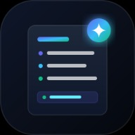
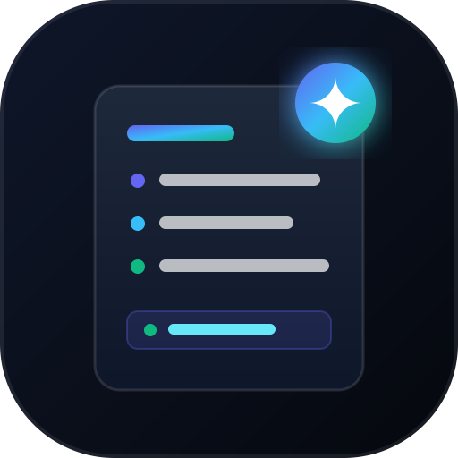

# ✨ ElevateCV

### AI Resume & Bio Summarizer

Turn rough resume notes into concise, high-impact accomplishments — and synthesize career bios for resumes, LinkedIn, and professional profiles.

ElevateCV is a **client-side Progressive Web App (PWA)** with a built-in NLP engine, optional Google Gemini/OpenAI integrations, ATS keyword matching, export tools, saved history, responsive mobile navigation, and offline caching.

<p align="center">
  
</p>

<p align="center">
  <strong>Polish your experience. Strengthen your story. Elevate your CV.</strong>
</p>

---

## 📸 Screenshots & Preview

> The repository includes the supplied ElevateCV visual preview. Add browser captures to `screenshots/` as the project evolves.

| Desktop | Mobile / PWA |
| --- | --- |
|  |  |

The interface uses an **Obsidian Slate + Electric Indigo glassmorphism** design system with responsive layouts for desktop and mobile. fileciteturn0file4L1-L4

---

## 🚀 Features

### ✍️ Bullet Enhancer

Transform weak or task-focused resume bullets into stronger accomplishment statements using:

- Google XYZ-style accomplishment framing
- STAR-style action/result writing
- Strong power verbs across leadership, technical, growth, efficiency, and analytics categories
- Concise and executive writing modes
- Optional metric enhancement
- Seniority-aware rewriting

### 👤 Bio Summarizer

Convert career notes into professional summaries in multiple formats:

- Executive Summary
- LinkedIn About
- Two-line Elevator Pitch
- Speaker / Conference Bio

### 🎯 ATS Matcher

Paste a target job description and compare your experience against relevant terminology and skills. ElevateCV can surface matched keywords and incorporate useful job-description language into the output.

### 🤖 AI Engines

Choose between:

- **Built-in Engine** — client-side heuristics and NLP; no API key required
- **Google Gemini** — optional live AI generation
- **OpenAI** — optional live AI generation

API credentials are stored locally in browser storage by the application. Never commit API keys to Git.

### 📦 Export & History

- Copy generated results
- Download Markdown (`.md`)
- Download plain text (`.txt`)
- Download Word-compatible document (`.doc`)
- Print / save as PDF
- Automatically save generated results to local history

### 📱 PWA / Mobile

ElevateCV is configured as a Progressive Web App with standalone display, an install flow, mobile bottom navigation, haptic feedback, safe-area support, and offline caching. fileciteturn0file2L5-L19 fileciteturn0file3L90-L96

---

## 🧰 Tech Stack

| Technology | Purpose |
| --- | --- |
| HTML5 | Application structure and semantic UI |
| CSS3 | Responsive glassmorphism design system |
| Vanilla JavaScript | Application logic and NLP heuristics |
| Web Storage | Local settings and history persistence |
| Service Worker | Offline caching and PWA behavior |
| Web App Manifest | Installable app metadata and shortcuts |
| Google Gemini API | Optional live AI engine |
| OpenAI API | Optional live AI engine |

No framework or build system is required for the core web app.

---

## 📁 Project Structure

```text
ElevateCV/
├── index.html              # Main application UI
├── style.css               # Design system and responsive styles
├── app.js                  # Application logic, NLP, AI integrations
├── manifest.json            # PWA manifest
├── sw.js                    # Service worker / offline cache
├── icon.svg                 # Primary app icon
├── icon.png                 # App icon asset
├── icon-512x512.png         # Large PWA icon
├── resized-image.jpeg       # Repository preview artwork
├── README.md                # Project documentation
└── .gitignore               # Git exclusions
```

The HTML links directly to the stylesheet, manifest, and app icon, so the project can be served as a static site without a bundler. fileciteturn0file1L9-L22

---

## ⚡ Quick Start

### 1. Clone the repository

```bash
git clone https://github.com/YOUR_USERNAME/elevatecv.git
cd elevatecv
```

### 2. Serve the app

Because the app uses a service worker, use a local HTTP server rather than opening `index.html` directly.

#### Python

```bash
python -m http.server 8080
```

Then open:

```text
http://localhost:8080
```

#### Node.js

```bash
npx serve .
```

Then open the URL printed by `serve`.

### 3. Start using ElevateCV

1. Choose **Bullet Enhancer**, **Bio Summarizer**, or **ATS Matcher**.
2. Paste your raw experience or career notes.
3. Choose tone and seniority.
4. Optionally provide a target job description.
5. Click **Generate**.
6. Copy or export the result.

The app loads a Software Engineer preset on startup so the interface has an immediately usable example. fileciteturn0file0L220-L227

---

## 🤖 Configure Live AI

The default engine is the built-in client-side engine. You can switch to Gemini or OpenAI from **AI Mode** in the header.

### Google Gemini

1. Open **AI Mode**.
2. Select Google Gemini.
3. Enter your API key.
4. Save the settings.

### OpenAI

1. Open **AI Mode**.
2. Select OpenAI.
3. Enter your API key.
4. Save the settings.

The application explicitly supports `builtin`, `gemini`, and `openai` providers and stores the selected engine/key in `localStorage`. fileciteturn0file0L122-L132

> **Security:** For a public GitHub deployment, do not hard-code a secret API key into `app.js`, HTML, CSS, or any committed file. Browser-side API keys can be exposed to users. For production use, route sensitive API requests through a secure backend.

---

## 🌐 Deployment

### GitHub Pages

ElevateCV is well suited to GitHub Pages because the core project is a static HTML/CSS/JavaScript application.

1. Push the project to GitHub:

```bash
git init
git add .
git commit -m "Initial ElevateCV release"
git branch -M main
git remote add origin https://github.com/YOUR_USERNAME/elevatecv.git
git push -u origin main
```

2. Open your repository on GitHub.
3. Go to **Settings → Pages**.
4. Under **Build and deployment**, select **Deploy from a branch**.
5. Select `main` and `/ (root)`.
6. Save.
7. Open the published Pages URL.

The repository includes `.nojekyll` so GitHub Pages can serve the static project without Jekyll processing.

### Netlify / Vercel / Cloudflare Pages

These platforms can deploy the project as a static site with no build command.

Recommended settings:

```text
Framework preset: None / Static
Build command:    None
Output directory: .
```

Deploy the repository root containing `index.html`, `style.css`, `app.js`, `manifest.json`, and `sw.js`.

---

## 📲 Install as a Phone App

After deploying over HTTPS:

### Android

Open the site in Chrome, then use the browser's **Install app** / **Add to Home screen** option. The project includes a standalone PWA manifest and installation handling. fileciteturn0file2L5-L15

### iPhone / iPad

Open the site in Safari → **Share** → **Add to Home Screen**.

The project includes iOS-specific PWA metadata and an in-app installation guide. fileciteturn0file1L9-L17

---

## 📴 Offline Support

The service worker pre-caches the application shell and uses a cache-first / network-fallback strategy for static resources. Navigation can fall back to `index.html` when offline. fileciteturn0file5L6-L20 fileciteturn0file5L36-L73

This makes the built-in experience usable without a network connection after the app has been cached. Live Gemini/OpenAI requests still require network access.

---

## 🎨 Design

ElevateCV uses:

- Dark Obsidian Slate background
- Electric Indigo, cyan, and emerald accents
- Glassmorphism cards
- Responsive dual-pane workspace
- Plus Jakarta Sans + JetBrains Mono typography
- Mobile-first navigation behavior
- Accessible semantic controls and labels

The stylesheet defines the core palette, typography, radii, shadows, transitions, and responsive workspace behavior. fileciteturn0file4L6-L50 fileciteturn0file4L302-L312

---

## 🛠️ Customization

Common places to customize the project:

### Branding

Edit the title/tagline in `index.html` and replace the supplied icon assets.

### Colors

Update the CSS custom properties in `style.css` under `:root`.

### Resume presets

Edit the `PRESETS` object in `app.js` to add or modify professional examples.

### NLP rules

The built-in engine uses power-verb matrices, weak-phrase patterns, common skills, metric detection, and ATS keyword matching. These rules can be expanded directly in `app.js`.

---

## 🔐 Privacy & Data

ElevateCV is designed around client-side processing and browser storage for the built-in workflow.

- Built-in processing runs in the browser.
- History is stored locally in browser storage.
- AI provider settings are stored locally.
- External AI requests are only made when a live provider is selected.
- Do not enter confidential resume information into third-party AI providers unless you understand their applicable data policies.

---

## 📄 License

No license file is currently included in the project. If you plan to publish this repository publicly, add a license such as MIT before accepting external contributions.

---

## ⭐ Roadmap Ideas

- [ ] Add automated browser screenshots to the repository
- [ ] Add unit tests for the NLP heuristics
- [ ] Add a secure server-side AI proxy
- [ ] Add richer ATS scoring explanations
- [ ] Add PDF resume parsing
- [ ] Add drag-and-drop resume import
- [ ] Add customizable resume templates
- [ ] Add CI validation for HTML, JavaScript, and manifest files

---

## 🙌 Contributing

Pull requests and improvements are welcome.

```bash
git checkout -b feature/my-improvement
# make your changes
git add .
git commit -m "Add my improvement"
git push origin feature/my-improvement
```

Then open a pull request on GitHub.

---

<p align="center">
  Made with ⚡ for better resumes and stronger career stories.
</p>
